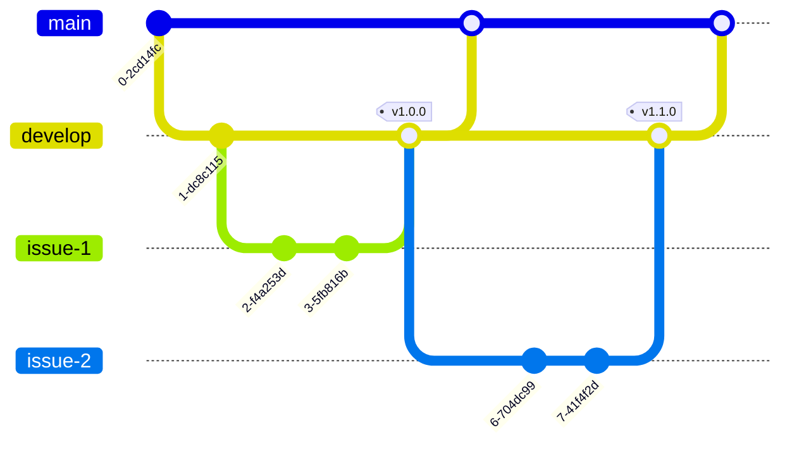
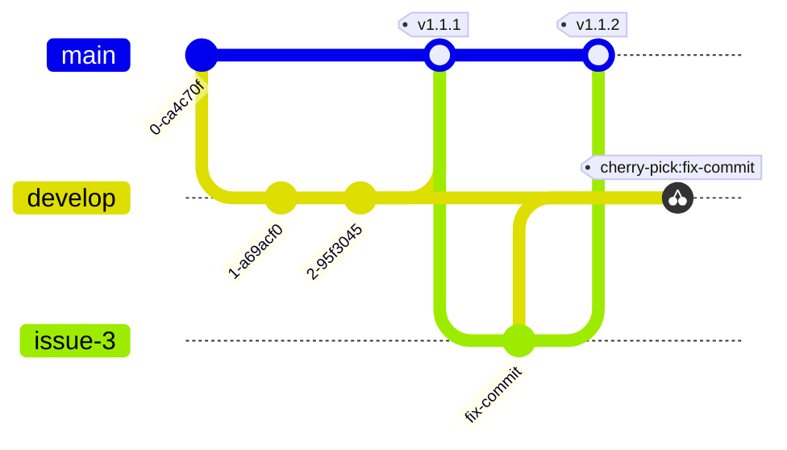

# mobile-user

This project is our main APP that will be used by our users.

## Getting Started

These instructions will give you a copy of the project up and running on
your local machine for development and testing purposes. See deployment
for notes on deploying the project on a live system.

### Prerequisites

Requirements for the software and other tools to build, test and push
- [Node.js](https://nodejs.org/en/)
- [NPM](https://docs.npmjs.com/downloading-and-installing-node-js-and-npm)
- [Expo Cli](https://docs.expo.dev/get-started/installation)

### Installing

A step by step series of examples that tell you how to get a development
environment running

Install the dependencies

    yarn

Start the APP

    yarn start

## Contributing

Understand how our Git flow works.

### Developing new features

### Fixing bugs

